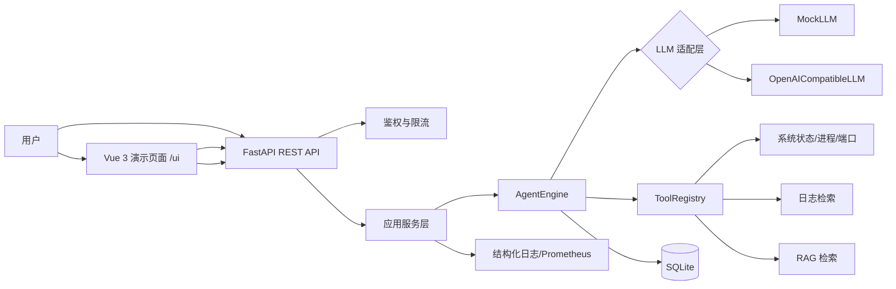
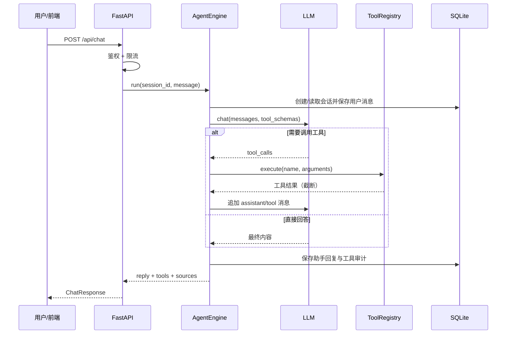
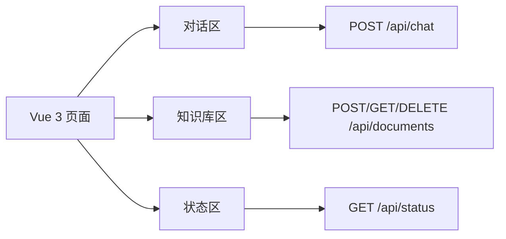

# AIOps Agent 智能运维诊断与监控服务：系统设计说明书

> 状态：草稿，待评审  
> 版本：v0.1  
> 日期：2026-09-07  
> 关联文档：`docs/01-requirements.md`

## 1. 设计目标

在满足需求规格的前提下，系统设计遵循以下原则：

1. 分层清晰：配置、存储、领域服务、API、工具、可观测性相互独立；
2. 可测试：默认 Mock LLM，核心流程无外部依赖即可自动化验证；
3. 可演进：Agent、LLM、向量检索、存储均提供抽象边界，支持后续替换；
4. 工程闭环：接口文档、测试、CI、容器化、监控指标齐全；
5. 学习友好：代码量控制在一个软件工程本科学生可逐行理解的规模。

## 2. 技术选型

| 层次 | 选型 | 说明 |
|---|---|---|
| 后端框架 | FastAPI + Pydantic v2 | 接口文档、数据校验、异步支持 |
| Web 服务 | Uvicorn | ASGI 服务器 |
| 存储 | SQLite（标准库 `sqlite3`） | MVP 轻量方案，存储层做抽象 |
| LLM 接入 | Mock / OpenAI 兼容 HTTP 接口 | 通过 `httpx` 调用 `/chat/completions` |
| Agent 编排 | 自研轻量循环 | 不引入 LangChain，便于理解与面试讲解 |
| RAG | 本地分块 + 本地向量 + SQLite 持久化 | 不依赖外部向量数据库 |
| 系统指标 | `psutil` | 采集 CPU、内存、磁盘、进程 |
| 监控 | `prometheus-client` | 暴露 `/metrics` |
| 前端 | Vue 3 轻量静态页面 | 由 FastAPI 挂载，无独立构建链 |
| 测试 | pytest + FastAPI TestClient | 单元/接口/集成测试 |
| CI | GitHub Actions | 自动安装依赖并运行测试 |

## 3. 总体架构



### 3.1 模块划分

```text
app/
├── main.py             # 应用装配、中间件、静态资源
├── config.py           # 环境配置与默认值
├── schemas.py          # Pydantic 请求/响应模型
├── db.py               # SQLite 连接、建表、仓储函数
├── security.py         # API Key 鉴权与限流
├── monitoring.py       # 系统状态采集
├── agent.py            # LLM 适配与 AgentEngine
├── tools.py            # 工具注册与诊断工具
├── rag.py              # 文档分块、本地向量、检索
├── api.py              # API 路由
└── logging_config.py   # 结构化日志

web/
├── index.html          # Vue 页面入口
├── assets/
│   ├── app.js          # Vue 应用逻辑
│   └── style.css       # 内部工具台样式
└── vendor/
    └── vue.global.prod.js

tests/
├── conftest.py
├── test_api.py
├── test_agent.py
├── test_rag.py
└── test_tools.py
```

## 4. 核心流程设计

### 4.1 Agent 对话流程



Agent 循环约束：

- 最大工具步骤：默认 3 轮；
- 工具输出长度：默认截断到 2000 字符；
- 单次工具执行超时：默认 5 秒；
- 工具执行前必须校验参数，未注册工具不可执行；
- 循环结束后仍未产出最终回答时，返回明确的降级消息。

### 4.2 RAG 检索流程

```text
上传 Markdown/TXT
  -> 提取文本
  -> 按 chunk_size=400、overlap=60 切分
  -> 本地哈希 Embedding
  -> 写入 documents/chunks 表

用户提问/Agent 检索
  -> 对 query 生成向量
  -> 与全部 chunk 向量计算余弦相似度
  -> 返回 top_k 片段与来源
  -> Agent 结合片段生成回答
```

向量方案说明：MVP 使用特征哈希 + 余弦相似度的轻量本地实现，便于无外部依赖运行；生产环境可替换为 OpenAI Embedding、pgvector、Milvus 等，不影响上层流程。

## 5. 数据模型

### 5.1 表结构

```text
sessions
  id            TEXT PK
  title         TEXT
  created_at    TEXT
  updated_at    TEXT

messages
  id            INTEGER PK AUTOINCREMENT
  session_id    TEXT FK -> sessions.id
  role          TEXT  -- user / assistant
  content       TEXT
  created_at    TEXT

documents
  id            TEXT PK
  name          TEXT
  size          INTEGER
  created_at    TEXT

chunks
  id            TEXT PK
  document_id   TEXT FK -> documents.id
  position      INTEGER
  content       TEXT
  vector        TEXT  -- JSON 数组

tool_runs
  id            INTEGER PK AUTOINCREMENT
  session_id    TEXT FK -> sessions.id
  name          TEXT
  arguments     TEXT
  output        TEXT
  status        TEXT
  duration_ms   REAL
  created_at    TEXT
```

索引建议：

- `messages(session_id, id)`；
- `chunks(document_id)`；
- `tool_runs(session_id, created_at)`；
- `sessions(updated_at)`。

## 6. API 设计

公共前缀：`/api`。除健康检查和指标外，接口需要请求头：

```text
X-API-Key: <APP_API_KEY>
```

### 6.1 健康与指标

| 方法 | 路径 | 说明 |
|---|---|---|
| GET | `/healthz` | 服务健康检查 |
| GET | `/metrics` | Prometheus 指标 |

### 6.2 会话

| 方法 | 路径 | 说明 |
|---|---|---|
| POST | `/api/sessions` | 创建会话 |
| GET | `/api/sessions` | 会话列表 |
| GET | `/api/sessions/{session_id}/messages` | 会话消息 |
| DELETE | `/api/sessions/{session_id}` | 删除会话 |

### 6.3 对话

```http
POST /api/chat
Content-Type: application/json
X-API-Key: dev-key
```

```json
{
  "session_id": null,
  "message": "查看服务器状态",
  "use_rag": true,
  "top_k": 3
}
```

```json
{
  "session_id": "s_xxx",
  "reply": "服务器整体状态正常，CPU 使用率 23%...",
  "tools_executed": [
    {"name": "get_system_status", "status": "success"}
  ],
  "sources": [],
  "provider": "mock",
  "model": "mock-llm",
  "latency_ms": 45
}
```

### 6.4 知识库与检索

| 方法 | 路径 | 说明 |
|---|---|---|
| POST | `/api/documents` | 上传排障手册 |
| GET | `/api/documents` | 文档列表 |
| DELETE | `/api/documents/{document_id}` | 删除文档 |
| POST | `/api/search` | 独立检索接口，便于验证 RAG |

### 6.5 诊断与工具

| 方法 | 路径 | 说明 |
|---|---|---|
| GET | `/api/tools` | 返回工具列表与 schema |
| GET | `/api/status` | 返回当前系统状态 |

### 6.6 前端入口

| 方法 | 路径 | 说明 |
|---|---|---|
| GET | `/ui` | Vue 演示页面 |
| GET | `/ui/assets/*` | 前端静态资源 |

## 7. 前端设计

前端定位为“内部运维 Agent 工具台”，采用 Vue 3 全局构建方式：

- FastAPI 挂载 `web/` 静态目录；
- 页面提供“对话”“知识库”“系统状态”三个功能区域；
- 对话页展示最终回答、工具调用记录、RAG 来源；
- 页面提供 API Key 输入框并暂存于浏览器本地，后续请求自动携带 `X-API-Key`；
- 页面通过 fetch 调用同源 `/api/*`，不引入复杂状态管理库。



## 8. 安全设计

1. API Key：通过 `APP_API_KEY` 环境变量配置，使用恒定时间比较；
2. 限流：进程内滑动窗口，默认 120 次/分钟，超限返回 429；
3. 工具边界：不开放任意 shell；日志检索、进程查看均限制在注册工具的受控动作内；
4. 输出治理：工具输出、日志片段、RAG 文本均限制长度；
5. 配置安全：API Key 与模型 Key 只通过环境变量注入，不写入仓库；
6. 前端说明：演示页面不承载用户中心或复杂权限，生产安全边界由后端 API 控制。

## 9. 可观测性设计

### 9.1 Prometheus 指标

- `http_requests_total{method,path,status}`；
- `http_request_duration_seconds`；
- `agent_tool_calls_total{tool,status}`；
- `agent_loop_steps_total`；
- `ai_chat_requests_total`。

### 9.2 结构化日志

关键节点输出 JSON 日志：

- 请求标识与耗时；
- 会话 ID；
- Agent 每轮调用的模型结果；
- 工具名称、参数摘要、状态与耗时；
- 最终回答长度与来源数量。

## 10. 配置设计

| 环境变量 | 默认值 | 说明 |
|---|---|---|
| `APP_NAME` | `aiops-agent` | 服务名称 |
| `APP_API_KEY` | `dev-key-change-me` | API Key |
| `DATABASE_PATH` | `./data/agent.db` | SQLite 路径 |
| `LLM_PROVIDER` | `mock` | `mock` 或 `openai` |
| `LLM_BASE_URL` | `https://api.openai.com/v1` | OpenAI 兼容地址 |
| `LLM_API_KEY` | 空 | 模型 API Key |
| `LLM_MODEL` | `gpt-4o-mini` | 模型名 |
| `MAX_TOOL_STEPS` | `3` | Agent 最大工具轮数 |
| `RATE_LIMIT` | `120` | 每分钟请求上限 |
| `HISTORY_LIMIT` | `10` | 保留的对话轮数 |

## 11. 测试设计

### 11.1 测试环境

- `conftest.py` 使用临时 SQLite 文件；
- 测试 API Key：`test-key`；
- 测试模型：`mock`；
- 每次测试前重置数据库。

### 11.2 测试范围

| 文件 | 覆盖内容 |
|---|---|
| `test_tools.py` | 工具参数解析、状态/日志工具、输出截断 |
| `test_rag.py` | 文档切分、向量生成、检索排序、删除后不可检索 |
| `test_agent.py` | Mock LLM 对话、工具调用循环、最大轮数保护 |
| `test_api.py` | 鉴权、限流、会话、聊天、文档、状态、指标接口 |

## 12. 部署与 CI/CD

### 12.1 本地运行

```bash
uvicorn app.main:app --reload --port 8000
```

### 12.2 Docker

```text
agent: FastAPI + Vue 静态资源
  ports: 8000
  volume: data
prometheus: 可选观测组件
  ports: 9090
  scrape target: agent:8000/metrics
```

### 12.3 GitHub Actions

CI 流程：

1. checkout；
2. 安装 Python 依赖；
3. 运行 `pytest`；
4. 构建 Docker 镜像（可选步骤）。

## 13. 关键设计决策记录

| 决策 | 选择 | 原因 |
|---|---|---|
| Agent 框架 | 自研轻量循环 | 可讲解、可控、无重框架学习成本 |
| 存储 | SQLite + 仓储抽象 | MVP 足够；便于替换 Postgres/MySQL |
| 向量 | 本地哈希向量 | 无外部依赖；生产可换真实 Embedding |
| LLM | Mock + OpenAI 兼容 | 离线可测，真实模型可切换 |
| 前端 | Vue 3 静态页面 | 满足 Vue 展示与前后端联调，避免 Node 构建拖慢主线 |
| 日志查询 | 受控工具 | 避免任意命令执行风险 |

## 14. 风险与应对

1. 工具结果污染上下文：输出截断、结构化摘要；
2. Agent 循环不收敛：最大轮数 + 超时；
3. RAG 检索质量不足：内置可解释的本地向量，后续替换真实 Embedding；
4. Vue 学习成本挤占后端时间：只做轻量演示界面，不做复杂组件体系；
5. Windows/Linux 环境差异：系统指标工具做异常降级，本地开发不依赖 Docker。

## 15. 后续演进方向

- 接入真实 Embedding 与 pgvector/Milvus；
- 支持远程主机 Agent 采集器与 SSH 安全通道；
- 异步任务队列与多 Worker 调度；
- 定时巡检、告警通知；
- Vue 前端升级为独立 Vite 工程并接入登录；
- 使用 Postgres/MySQL 替换 SQLite。
